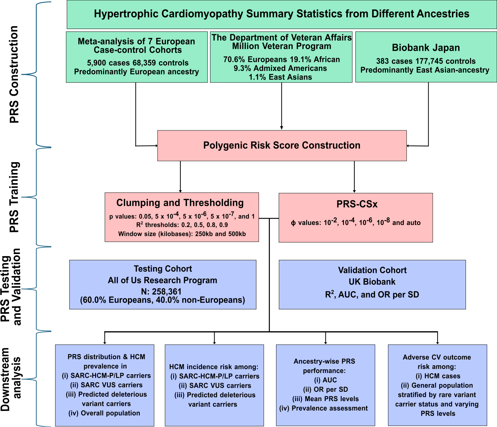

# Multi-Ancestry Hypertrophic Cardiomyopathy (HCM) Polygenic Risk Score (PRS) Analysis Pipeline

This repository contains the complete analytical pipeline, computational scripts, and visualization code used to evaluate a multi-ancestry polygenic risk score (PRS) for hypertrophic cardiomyopathy (HCM).

## Overview
* **Objective:** To construct and evaluate a multi-ancestry PRS for HCM using PRS-CSx and clumping-and-thresholding (C+T) frameworks, assessing disease penetrance, prevalence, lifetime incidence, ancestry-specific performance, and longitudinal cardiovascular outcomes.
* **Testing Dataset:** All of Us Research Program (AoURP) (~258,361 participants across European, African, admixed, and Asian ancestries).
* **Validation Cohort:** UK Biobank.
* **Base Data Sources:** Summary statistics from Biobank Japan, the Million Veteran Program (MVP), and European case-control meta-analyses.

## Pipeline Architecture & Analytical Workflow
The diagram below illustrates the comprehensive workflow for multi-ancestry polygenic risk score (PRS) construction, training, testing, validation, and downstream clinical analysis:

## Repository Structure & Master Execution
* `Codes/Code_for_PRScsx_C_T_Generation_07242026.sh`: Primary shell script executing PRScsx and C+T generation pipelines.
* `Codes/Code_for_Association_Downstream_Manuscript_07312026.R`: Comprehensive R script containing data wrangling, logistic regression, interval-censored survival analysis (`icenReg`), ancestry stratification, and figure generation routines.
* `environment/`: Environment configuration containing Dockerfile and `environment.yml`.
* `LP/P/VUS/PUPv Carriers Generation`: [https://github.com/akhilpampana/Pipeline_LP_P_Circ_GPM_AoU/archive/refs/tags/v1.0.zip](https://github.com/akhilpampana/Pipeline_LP_P_Circ_GPM_AoU/archive/refs/tags/v1.0.zip)

## System & Software Requirements
* **Languages:** Bash, R (v4.0+)
* **External Tools:** PLINK v1.9 / v2.0, Python / PRScsx framework
* **R Packages:** `parallel`, `fmsb`, `pROC`, `dplyr`, `stats`, `icenReg`, `purrr`, `doParallel`, `tidyr`, `knitr`, `kableExtra`, `ggplot2`, `cowplot`, `ggpubr`, `gridExtra`, `plotrix`

## Execution Instructions
The provided scripts serve as a static analytical record and reference implementation for the manuscript pipelines. They are structured for inspection and modular execution across computing environments rather than automated batch invocation.

## Citation
If you use this pipeline or data in your research, please cite our corresponding publication: 
Bal et al, 2026: A multi-ancestry polygenic risk score improves stratification in patients with hypertrophic cardiomyopathy

## Contact
For questions, feedback, or issues regarding this repository, please contact Akhil Pampana at the University of Alabama at Birmingham.

## License
This project is licensed under the terms of the MIT License. See the LICENSE file for details.
